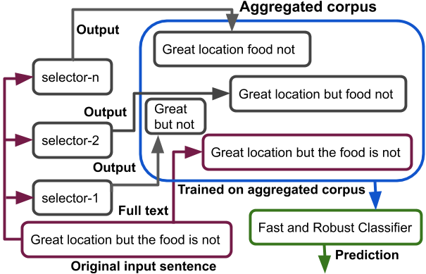
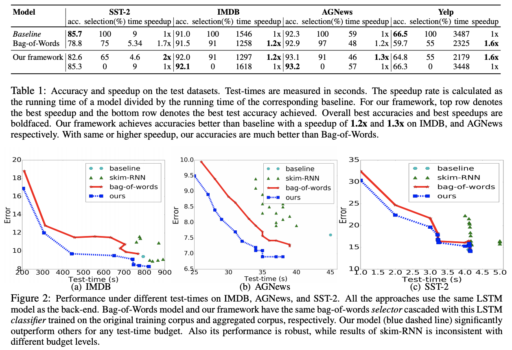

## [Robust Text Classifier on Test-Time Budgets](https://arxiv.org/abs/1707.09457) ##
[Md Rizwan Parvez](https://sites.google.com/site/parvezmdrizwan/), [Tolga Bolukbasi](http://people.bu.edu/tolgab/) [Kai-Wei Chang](http://www.cs.ucla.edu/~kc2wc/),[Venkatesh Saligrama](https://www.bu.edu/eng/profile/venkatesh-saligrama/): EMNLP-IJCAI 2019


**For details, please refer to [this paper](https://arxiv.org/abs/1808.08270)**


- ### Abstract

We design a generic framework for learning a robust text classification model that achieves high accuracy under different selection budgets  (a.k.a selection rates) at test-time. We take a different approach from existing methods and learn to dynamically filter a large fraction of unimportant words by a low-complexity selector such that any high-complexity classifier only needs to process a small fraction of text, relevant for the target task. To this end, we propose a data aggregation method for training the classifier, allowing it to achieve competitive performance on fractured sentences. On four
benchmark text classification tasks, we demonstrate that the framework gains consistent speedup with little degradation in accuracy on various selection budgets.

|             |
| ---------------------------------------- |
| *Our proposed framework. Given a selection rate, a selector is designed to select relevant words and pass them to the classifier. To make the classifier robust against fractured sentences, we aggregate outputs from different selectors and train the classifier on the aggregated corpus.* |

- ### Source Code Notes: 
please see the run_scripts ``run_experiments.py``, ``lstm_experiments.py``, source code [skim_LSTM.py](https://github.com/uclanlp/Fast-and-Robust-Text-Classification/blob/master/allennlp/models/skim_LSTM.py])
See an example source code of L1 regularized bag-of-words selector (i) [train_model](https://github.com/uclanlp/Fast-and-Robust-Text-Classification/blob/master/imdb_main_L1_regression.py) (ii) [generate slector output text using the trained model](https://github.com/uclanlp/Fast-and-Robust-Text-Classification/blob/master/data_generator_for_allaennlp_L1_LSTM.py)


- ### Data

- ### Reference
  Please cite

 ```
 @article{parvez2018building,
  title={Building a Robust Text Classifier on a Test-Time Budget},
  author={Parvez, Md Rizwan and Balukbasi, Tolga and Sarigrama, Venkatesh},
  booktile={emnlp}
  year={2019}
}
 ```
 
 

- ### Results
|              |
| ---------------------------------------- |
||

  

